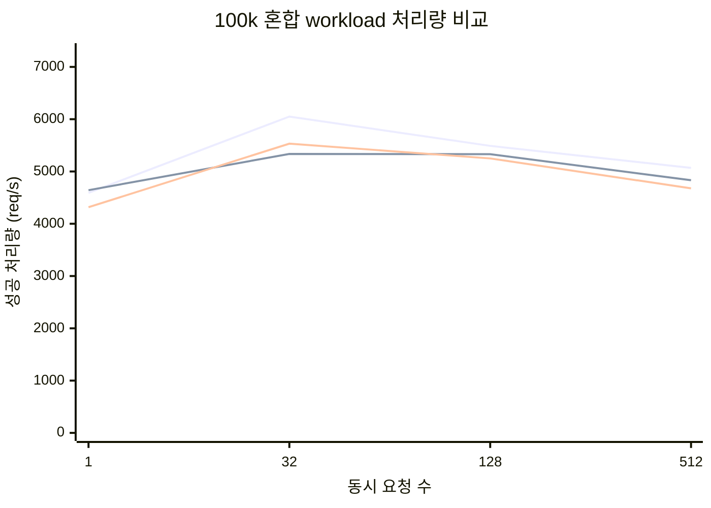
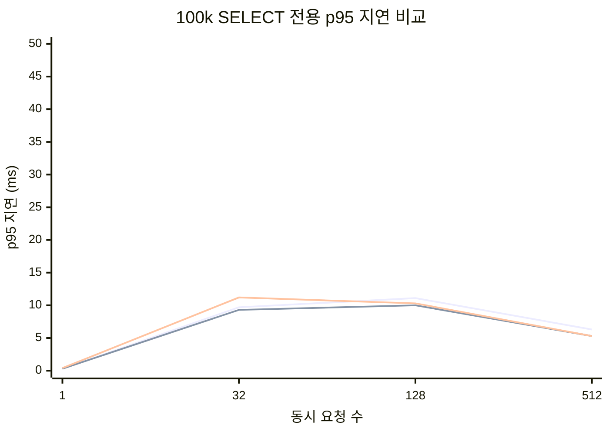

# 서버 처리 모델 비교 리포트

## 이 문서를 처음 보는 분을 위한 안내

이 문서는 같은 DB API 서버를 세 가지 방식으로 운영했을 때 어떤 차이가 나는지 비교한 결과입니다.

- 직렬 서버: 요청을 한 번에 하나씩 처리합니다. 창구가 1개인 상황에 가깝습니다.
- 스레드풀 서버: 미리 만들어 둔 worker thread들이 요청을 나눠 처리합니다. 현재 팀 구현과 같은 방식입니다.
- 요청당 스레드 서버: 요청이 들어올 때마다 새 thread를 만들어 처리합니다.

용어 설명:
- 처리량(req/s): 1초에 성공적으로 끝낸 요청 수입니다. 높을수록 좋습니다.
- 평균 지연(avg): 전체 요청의 평균 응답 시간입니다.
- p95 지연: 느린 쪽 5% 구간이 시작되는 응답 시간입니다. 사용자가 체감하는 '가끔 너무 느린 순간'을 보는 지표입니다.
- 503: 서버가 현재 감당할 수 없어 요청을 거절한 횟수입니다.
- 오류(error): 503 외의 실패입니다. 연결 실패, timeout 같은 경우가 여기에 들어갑니다.
- RSS: 서버가 실제로 점유한 메모리 크기입니다. 이 보고서에서는 읽기 쉽게 MB로 환산해 표기했습니다.
- Voluntary / Involuntary context switch: CPU가 thread를 바꿔 끼우는 횟수로, 높을수록 운영 비용이 커질 수 있습니다.

## 실험 원칙

- HTTP API, SQL 처리 로직, DB 파일, lock 정책은 모두 동일하게 유지했습니다.
- 바뀐 것은 `요청을 worker에게 어떻게 넘기느냐`뿐입니다.
- 같은 머신에서 같은 데이터셋과 같은 요청 패턴으로 반복 측정했습니다.
- 반복 횟수: 각 조합 `10회`

## 핵심 결론

- 기본 비교(100k, 동시성 1~128)에서는 세 모델의 순수 처리량 차이가 생각보다 크지 않았습니다. 읽기 전용 `concurrency 32`에서 스레드풀은 직렬 대비 약 `1.04배` 빨랐지만, 그 외 다수 구간은 비슷하거나 직렬이 앞섰습니다.
- 쓰기 중심(`insert-only`)에서는 병렬 이점이 크지 않았습니다. `concurrency 32`에서 직렬은 `5891.3 req/s`, 스레드풀은 `5347.4 req/s`로, write lock 병목이 더 크게 작용했습니다.
- 혼합 workload에서는 스레드풀이 절대 처리량보다 `p95 안정화` 쪽에서 더 자주 장점을 보였습니다. `100k mixed / concurrency 128`에서 직렬의 처리량은 더 높았지만 (`5489.9 req/s` vs `5331.3 req/s`), p95는 스레드풀이 더 낮았습니다 (`7.2 ms` vs `12.9 ms`).
- 순간 부하가 커지면 스레드풀의 장점이 더 분명해졌습니다. `100k mixed / burst 1024`에서 스레드풀은 직렬보다 처리량이 높고 (`4745.5` vs `4172.0 req/s`), p95도 더 낮았습니다 (`4.8` vs `8.6 ms`).
- 초고동시성 과부하(`async 2000`, `async 5000`)에서는 해석이 달라집니다. 직렬은 `503` 없이 전부 받아주지만 p95가 `약 2.7~2.8초`까지 늘어났습니다.
- 같은 과부하 구간에서 요청당 스레드 방식은 `async 2000`에서는 성공 처리량이 가장 높았지만, 메모리는 스레드풀보다 약 `3.0배`, context switch는 약 `1.4배` 많았습니다.
- 정리하면 이번 환경에서 스레드풀의 가장 큰 장점은 '항상 제일 빠름'이 아니라 `burst와 overload에서 지연을 통제하면서, 요청당 스레드보다 훨씬 적은 비용으로 버틴다`는 점이었습니다.

## 대표 장면 요약

| 대표 시나리오 | 직렬 서버 | 스레드풀 서버 | 요청당 스레드 서버 | 읽는 포인트 |
| --- | --- | --- | --- | --- |
| 100k SELECT / 동시성 32 | `4952 req/s`, p95 `9.7 ms`, RSS `5.8 MB` | `5169 req/s`, p95 `9.3 ms`, RSS `5.9 MB` | `4719 req/s`, p95 `11.2 ms`, RSS `6.4 MB` | 기본 부하에서는 세 모델 차이가 크지 않고, p95와 운영 비용 차이를 함께 봐야 합니다. |
| 100k INSERT / 동시성 32 | `5891 req/s`, p95 `8.6 ms`, RSS `5.8 MB` | `5347 req/s`, p95 `9.0 ms`, RSS `6.0 MB` | `5364 req/s`, p95 `8.9 ms`, RSS `6.5 MB` | write lock 영향이 커서 병렬 이점이 작습니다. |
| 100k 혼합 / 동시성 128 | `5490 req/s`, p95 `12.9 ms`, RSS `5.8 MB` | `5331 req/s`, p95 `7.2 ms`, RSS `5.9 MB` | `5249 req/s`, p95 `7.9 ms`, RSS `6.5 MB` | 기본 부하에서는 세 모델 차이가 크지 않고, p95와 운영 비용 차이를 함께 봐야 합니다. |
| 100k 혼합 / burst 1024 | `4172 req/s`, p95 `8.6 ms`, RSS `5.8 MB` | `4745 req/s`, p95 `4.8 ms`, RSS `6.1 MB` | `4609 req/s`, p95 `6.9 ms`, RSS `6.4 MB` | 순간 부하가 커질수록 스레드풀이 균형이 좋습니다. |
| 100k 혼합 / async 2000 | `604 req/s`, p95 `2711.0 ms`, RSS `5.9 MB` | `853 req/s`, p95 `305.6 ms`, RSS `6.1 MB` | `1333 req/s`, p95 `232.6 ms`, RSS `18.0 MB` | 직렬은 전부 수용하지만 매우 오래 기다리게 하고, 병렬 두 방식은 빠르게 503을 반환합니다. |
| 100k 혼합 / async 5000 | `1561 req/s`, p95 `2810.8 ms`, RSS `6.0 MB` | `596 req/s`, p95 `632.1 ms`, RSS `6.1 MB` | `644 req/s`, p95 `653.2 ms`, RSS `18.0 MB` | 직렬은 전부 수용하지만 매우 오래 기다리게 하고, 병렬 두 방식은 빠르게 503을 반환합니다. |

## 그래프

## 기본 비교 전체 결과

| 모델 | 시나리오 | 처리량(req/s) | 평균 지연(ms) | p95(ms) | 성공 | 503 | 오류 | RSS(MB) | Vol CS | Invol CS |
| --- | --- | --- | --- | --- | --- | --- | --- | --- | --- | --- |
| 직렬 서버 | 100k rows, insert-only, concurrency 1 | 3731.4 +- 1260.1 | 0.3 +- 0.1 | 0.6 +- 0.3 | 512 +- 0 | 0 +- 0 | 0 +- 0 | 5.8 +- 0.0 | 970 | 470 |
| 직렬 서버 | 100k rows, insert-only, concurrency 128 | 5142.4 +- 400.7 | 5.4 +- 3.4 | 13.0 +- 9.1 | 512 +- 0 | 0 +- 0 | 0 +- 0 | 5.8 +- 0.0 | 134 | 233 |
| 직렬 서버 | 100k rows, insert-only, concurrency 32 | 5891.3 +- 573.1 | 4.8 +- 0.6 | 8.6 +- 4.1 | 512 +- 0 | 0 +- 0 | 0 +- 0 | 5.8 +- 0.0 | 94 | 201 |
| 직렬 서버 | 100k rows, insert-only, burst concurrency 512 | 4716.9 +- 1579.0 | 22.5 +- 62.9 | 107.9 +- 327.7 | 512 +- 0 | 0 +- 0 | 0 +- 0 | 5.8 +- 0.0 | 170 | 251 |
| 직렬 서버 | 100k rows, mixed, concurrency 1 | 4590.7 +- 539.8 | 0.2 +- 0.0 | 0.4 +- 0.1 | 512 +- 0 | 0 +- 0 | 0 +- 0 | 5.8 +- 0.0 | 1000 | 272 |
| 직렬 서버 | 100k rows, mixed, concurrency 128 | 5489.9 +- 645.5 | 5.1 +- 3.1 | 12.9 +- 11.8 | 512 +- 0 | 0 +- 0 | 0 +- 0 | 5.8 +- 0.0 | 153 | 190 |
| 직렬 서버 | 100k rows, mixed, concurrency 32 | 6050.3 +- 692.4 | 4.7 +- 0.6 | 9.0 +- 3.8 | 512 +- 0 | 0 +- 0 | 0 +- 0 | 5.8 +- 0.0 | 107 | 180 |
| 직렬 서버 | 100k rows, mixed, burst concurrency 512 | 5068.1 +- 494.7 | 3.4 +- 1.9 | 8.2 +- 7.9 | 512 +- 0 | 0 +- 0 | 0 +- 0 | 5.8 +- 0.0 | 184 | 235 |
| 직렬 서버 | 100k rows, select-only, concurrency 1 | 4751.6 +- 500.6 | 0.2 +- 0.0 | 0.3 +- 0.1 | 512 +- 0 | 0 +- 0 | 0 +- 0 | 5.8 +- 0.0 | 857 | 370 |
| 직렬 서버 | 100k rows, select-only, concurrency 128 | 4538.0 +- 303.0 | 5.5 +- 0.6 | 11.1 +- 1.7 | 512 +- 0 | 0 +- 0 | 0 +- 0 | 5.8 +- 0.0 | 134 | 246 |
| 직렬 서버 | 100k rows, select-only, concurrency 32 | 4951.7 +- 298.4 | 5.7 +- 0.4 | 9.7 +- 1.7 | 512 +- 0 | 0 +- 0 | 0 +- 0 | 5.8 +- 0.0 | 112 | 268 |
| 직렬 서버 | 100k rows, select-only, burst concurrency 512 | 4351.1 +- 303.1 | 3.7 +- 0.2 | 6.3 +- 1.1 | 512 +- 0 | 0 +- 0 | 0 +- 0 | 5.8 +- 0.0 | 160 | 182 |
| 요청당 스레드 서버 | 100k rows, insert-only, concurrency 1 | 4203.8 +- 792.7 | 0.2 +- 0.0 | 0.4 +- 0.1 | 512 +- 0 | 0 +- 0 | 0 +- 0 | 5.8 +- 0.0 | 552 | 771 |
| 요청당 스레드 서버 | 100k rows, insert-only, concurrency 128 | 5046.3 +- 378.4 | 4.4 +- 2.4 | 11.1 +- 5.7 | 512 +- 0 | 0 +- 0 | 0 +- 0 | 6.8 +- 0.6 | 1374 | 1222 |
| 요청당 스레드 서버 | 100k rows, insert-only, concurrency 32 | 5363.8 +- 337.3 | 5.0 +- 0.3 | 8.9 +- 1.5 | 512 +- 0 | 0 +- 0 | 0 +- 0 | 6.5 +- 0.0 | 1360 | 1241 |
| 요청당 스레드 서버 | 100k rows, insert-only, burst concurrency 512 | 4886.3 +- 383.2 | 5.1 +- 6.9 | 11.0 +- 16.4 | 512 +- 0 | 0 +- 0 | 0 +- 0 | 6.7 +- 1.4 | 1378 | 1187 |
| 요청당 스레드 서버 | 100k rows, mixed, concurrency 1 | 4315.7 +- 450.7 | 0.2 +- 0.0 | 0.4 +- 0.1 | 512 +- 0 | 0 +- 0 | 0 +- 0 | 5.8 +- 0.0 | 555 | 810 |
| 요청당 스레드 서버 | 100k rows, mixed, concurrency 128 | 5249.4 +- 358.0 | 3.4 +- 0.2 | 7.9 +- 1.0 | 512 +- 0 | 0 +- 0 | 0 +- 0 | 6.5 +- 0.0 | 1406 | 1057 |
| 요청당 스레드 서버 | 100k rows, mixed, concurrency 32 | 5532.3 +- 508.0 | 4.8 +- 0.4 | 8.7 +- 2.1 | 512 +- 0 | 0 +- 0 | 0 +- 0 | 6.5 +- 0.0 | 1387 | 1150 |
| 요청당 스레드 서버 | 100k rows, mixed, burst concurrency 512 | 4677.6 +- 458.1 | 2.3 +- 0.2 | 3.9 +- 0.8 | 512 +- 0 | 0 +- 0 | 0 +- 0 | 6.1 +- 0.0 | 1392 | 1061 |
| 요청당 스레드 서버 | 100k rows, select-only, concurrency 1 | 4328.8 +- 323.4 | 0.2 +- 0.0 | 0.4 +- 0.1 | 512 +- 0 | 0 +- 0 | 0 +- 0 | 5.8 +- 0.0 | 583 | 902 |
| 요청당 스레드 서버 | 100k rows, select-only, concurrency 128 | 4558.9 +- 289.2 | 4.2 +- 0.3 | 10.3 +- 1.1 | 512 +- 0 | 0 +- 0 | 0 +- 0 | 6.6 +- 0.1 | 1373 | 1119 |
| 요청당 스레드 서버 | 100k rows, select-only, concurrency 32 | 4719.0 +- 266.1 | 5.7 +- 0.4 | 11.2 +- 1.5 | 512 +- 0 | 0 +- 0 | 0 +- 0 | 6.4 +- 0.0 | 1367 | 1210 |
| 요청당 스레드 서버 | 100k rows, select-only, burst concurrency 512 | 4115.6 +- 256.0 | 2.9 +- 0.1 | 5.3 +- 0.6 | 512 +- 0 | 0 +- 0 | 0 +- 0 | 6.1 +- 0.0 | 1345 | 1073 |
| 스레드풀 서버 | 100k rows, insert-only, concurrency 1 | 4153.3 +- 203.6 | 0.2 +- 0.0 | 0.4 +- 0.0 | 512 +- 0 | 0 +- 0 | 0 +- 0 | 5.9 +- 0.0 | 888 | 842 |
| 스레드풀 서버 | 100k rows, insert-only, concurrency 128 | 5173.0 +- 455.2 | 3.8 +- 1.0 | 9.2 +- 3.1 | 512 +- 0 | 0 +- 0 | 0 +- 0 | 5.9 +- 0.0 | 1029 | 639 |
| 스레드풀 서버 | 100k rows, insert-only, concurrency 32 | 5347.4 +- 791.4 | 5.1 +- 0.6 | 9.0 +- 2.5 | 512 +- 0 | 0 +- 0 | 0 +- 0 | 6.0 +- 0.0 | 826 | 711 |
| 스레드풀 서버 | 100k rows, insert-only, burst concurrency 512 | 4863.2 +- 339.6 | 2.2 +- 0.1 | 3.7 +- 0.5 | 512 +- 0 | 0 +- 0 | 0 +- 0 | 6.1 +- 0.0 | 1402 | 1084 |
| 스레드풀 서버 | 100k rows, mixed, concurrency 1 | 4642.5 +- 495.7 | 0.2 +- 0.0 | 0.3 +- 0.0 | 512 +- 0 | 0 +- 0 | 0 +- 0 | 5.9 +- 0.0 | 887 | 758 |
| 스레드풀 서버 | 100k rows, mixed, concurrency 128 | 5331.3 +- 352.1 | 3.2 +- 0.2 | 7.2 +- 0.7 | 512 +- 0 | 0 +- 0 | 0 +- 0 | 5.9 +- 0.0 | 1086 | 558 |
| 스레드풀 서버 | 100k rows, mixed, concurrency 32 | 5335.5 +- 718.3 | 5.3 +- 0.9 | 12.5 +- 6.9 | 512 +- 0 | 0 +- 0 | 0 +- 0 | 5.9 +- 0.0 | 849 | 547 |
| 스레드풀 서버 | 100k rows, mixed, burst concurrency 512 | 4832.6 +- 450.0 | 2.3 +- 0.2 | 4.1 +- 1.0 | 512 +- 0 | 0 +- 0 | 0 +- 0 | 6.0 +- 0.0 | 1407 | 1039 |
| 스레드풀 서버 | 100k rows, select-only, concurrency 1 | 4622.5 +- 225.2 | 0.2 +- 0.0 | 0.3 +- 0.0 | 512 +- 0 | 0 +- 0 | 0 +- 0 | 5.8 +- 0.0 | 718 | 913 |
| 스레드풀 서버 | 100k rows, select-only, concurrency 128 | 4520.5 +- 323.4 | 4.4 +- 0.4 | 10.0 +- 1.7 | 512 +- 0 | 0 +- 0 | 0 +- 0 | 5.8 +- 0.0 | 953 | 460 |
| 스레드풀 서버 | 100k rows, select-only, concurrency 32 | 5168.7 +- 328.8 | 5.3 +- 0.4 | 9.3 +- 1.6 | 512 +- 0 | 0 +- 0 | 0 +- 0 | 5.9 +- 0.0 | 843 | 520 |
| 스레드풀 서버 | 100k rows, select-only, burst concurrency 512 | 4131.1 +- 211.3 | 2.8 +- 0.2 | 5.3 +- 0.6 | 512 +- 0 | 0 +- 0 | 0 +- 0 | 6.0 +- 0.0 | 1334 | 848 |

## 확장 비교 전체 결과

| 모델 | 시나리오 | 처리량(req/s) | 평균 지연(ms) | p95(ms) | 성공 | 503 | 오류 | RSS(MB) | Vol CS | Invol CS |
| --- | --- | --- | --- | --- | --- | --- | --- | --- | --- | --- |
| 직렬 서버 | 100k rows, mixed, burst concurrency 1024 | 4172.0 +- 1735.1 | 6.4 +- 8.5 | 8.6 +- 8.4 | 1024 +- 0 | 0 +- 0 | 0 +- 0 | 5.8 +- 0.0 | 387 | 341 |
| 직렬 서버 | 10k rows, mixed, steady concurrency 128 | 5258.9 +- 501.0 | 6.6 +- 6.7 | 15.1 +- 14.3 | 512 +- 0 | 0 +- 0 | 0 +- 0 | 2.0 +- 0.0 | 147 | 114 |
| 직렬 서버 | 1M rows, mixed, burst concurrency 1024 | 5013.6 +- 516.1 | 2.6 +- 0.2 | 4.1 +- 0.6 | 1024 +- 0 | 0 +- 0 | 0 +- 0 | 43.7 +- 0.1 | 407 | 1234 |
| 직렬 서버 | 1M rows, mixed, steady concurrency 128 | 5338.6 +- 411.8 | 3.7 +- 0.2 | 7.8 +- 0.5 | 512 +- 0 | 0 +- 0 | 0 +- 0 | 43.8 +- 0.0 | 164 | 926 |
| 요청당 스레드 서버 | 100k rows, mixed, burst concurrency 1024 | 4609.1 +- 275.4 | 2.9 +- 1.7 | 6.9 +- 8.5 | 1024 +- 0 | 0 +- 0 | 0 +- 0 | 6.4 +- 0.8 | 2775 | 2193 |
| 요청당 스레드 서버 | 10k rows, mixed, steady concurrency 128 | 5145.3 +- 426.8 | 3.2 +- 0.2 | 7.8 +- 1.0 | 512 +- 0 | 0 +- 0 | 0 +- 0 | 2.7 +- 0.0 | 1393 | 1010 |
| 요청당 스레드 서버 | 1M rows, mixed, burst concurrency 1024 | 4769.9 +- 302.7 | 2.3 +- 0.3 | 4.6 +- 2.1 | 1024 +- 0 | 0 +- 0 | 0 +- 0 | 44.1 +- 0.2 | 2778 | 2904 |
| 요청당 스레드 서버 | 1M rows, mixed, steady concurrency 128 | 5051.6 +- 382.3 | 4.7 +- 3.9 | 10.9 +- 7.2 | 512 +- 0 | 0 +- 0 | 0 +- 0 | 44.7 +- 0.4 | 1376 | 1860 |
| 스레드풀 서버 | 100k rows, mixed, burst concurrency 1024 | 4745.5 +- 367.6 | 2.3 +- 0.4 | 4.8 +- 2.8 | 1024 +- 0 | 0 +- 0 | 0 +- 0 | 6.1 +- 0.0 | 2811 | 2025 |
| 스레드풀 서버 | 10k rows, mixed, steady concurrency 128 | 5070.0 +- 685.1 | 4.3 +- 2.7 | 11.4 +- 9.6 | 512 +- 0 | 0 +- 0 | 0 +- 0 | 2.1 +- 0.0 | 1058 | 537 |
| 스레드풀 서버 | 1M rows, mixed, burst concurrency 1024 | 4810.7 +- 232.1 | 2.3 +- 0.2 | 3.8 +- 0.5 | 1024 +- 0 | 0 +- 0 | 0 +- 0 | 44.0 +- 0.0 | 2834 | 2919 |
| 스레드풀 서버 | 1M rows, mixed, steady concurrency 128 | 5007.8 +- 405.9 | 4.0 +- 1.8 | 9.7 +- 6.1 | 512 +- 0 | 0 +- 0 | 0 +- 0 | 44.0 +- 0.0 | 1267 | 1658 |

## 고동시성 async 전체 결과

| 모델 | 시나리오 | 처리량(req/s) | 평균 지연(ms) | p95(ms) | 성공 | 503 | 오류 | RSS(MB) | Vol CS | Invol CS |
| --- | --- | --- | --- | --- | --- | --- | --- | --- | --- | --- |
| 직렬 서버 | 1,000,000 rows, mixed, async burst 2000 | 636.6 +- 50.4 | 1547.3 +- 92.8 | 3009.0 +- 468.2 | 2000 +- 0 | 0 +- 0 | 0 +- 0 | 43.8 +- 0.0 | 100 | 1264 |
| 직렬 서버 | 1,000,000 rows, mixed, async burst 5000 | 1405.7 +- 184.2 | 1621.4 +- 65.7 | 2912.6 +- 314.1 | 5000 +- 0 | 0 +- 0 | 0 +- 0 | 43.9 +- 0.0 | 215 | 2204 |
| 직렬 서버 | 100,000 rows, mixed, async burst 2000 | 604.4 +- 77.1 | 1518.0 +- 161.0 | 2711.0 +- 479.5 | 2000 +- 0 | 0 +- 0 | 0 +- 0 | 5.9 +- 0.0 | 117 | 512 |
| 직렬 서버 | 100,000 rows, mixed, async burst 5000 | 1561.0 +- 19.7 | 1628.6 +- 64.2 | 2810.8 +- 416.7 | 5000 +- 0 | 0 +- 0 | 0 +- 0 | 6.0 +- 0.0 | 217 | 1369 |
| 요청당 스레드 서버 | 1,000,000 rows, mixed, async burst 2000 | 1892.1 +- 715.4 | 180.3 +- 6.8 | 222.0 +- 8.3 | 527 +- 21 | 1473 +- 21 | 0 +- 0 | 55.9 +- 0.0 | 1652 | 2893 |
| 요청당 스레드 서버 | 1,000,000 rows, mixed, async burst 5000 | 713.6 +- 135.4 | 501.3 +- 18.1 | 627.0 +- 15.8 | 527 +- 13 | 4473 +- 13 | 0 +- 0 | 55.9 +- 0.0 | 3576 | 3520 |
| 요청당 스레드 서버 | 100,000 rows, mixed, async burst 2000 | 1332.9 +- 858.0 | 185.5 +- 8.0 | 232.6 +- 13.5 | 531 +- 16 | 1469 +- 16 | 0 +- 0 | 18.0 +- 0.0 | 1669 | 2065 |
| 요청당 스레드 서버 | 100,000 rows, mixed, async burst 5000 | 643.6 +- 118.4 | 517.1 +- 27.6 | 653.2 +- 37.1 | 540 +- 33 | 4460 +- 33 | 0 +- 0 | 18.0 +- 0.1 | 3681 | 2682 |
| 스레드풀 서버 | 1,000,000 rows, mixed, async burst 2000 | 1226.4 +- 893.2 | 186.3 +- 19.4 | 224.5 +- 13.8 | 541 +- 28 | 1459 +- 28 | 0 +- 0 | 44.0 +- 0.0 | 1283 | 2170 |
| 스레드풀 서버 | 1,000,000 rows, mixed, async burst 5000 | 732.3 +- 136.2 | 499.7 +- 28.8 | 629.6 +- 35.9 | 532 +- 20 | 4468 +- 20 | 0 +- 0 | 44.0 +- 0.0 | 3246 | 2743 |
| 스레드풀 서버 | 100,000 rows, mixed, async burst 2000 | 853.5 +- 685.5 | 190.0 +- 14.9 | 305.6 +- 245.2 | 544 +- 34 | 1456 +- 34 | 0 +- 0 | 6.1 +- 0.0 | 1239 | 1447 |
| 스레드풀 서버 | 100,000 rows, mixed, async burst 5000 | 596.5 +- 124.4 | 502.1 +- 27.2 | 632.1 +- 32.9 | 551 +- 25 | 4449 +- 25 | 0 +- 0 | 6.1 +- 0.0 | 3271 | 1817 |

## 해석

- 이번 환경에서는 병렬 처리의 이점이 `항상 큰 처리량 증가`로 나타나지는 않았습니다. 기본 부하에서는 직렬이 비슷하거나 더 빠른 구간도 적지 않았습니다.
- 다만 병렬 모델은 읽기/혼합 workload에서 p95를 낮추거나, burst 상황에서 더 나은 응답 품질을 주는 방향으로 강점을 보였습니다.
- 요청당 스레드 방식은 overload에서 빠른 처리량을 내는 순간도 있었지만, 메모리와 context switch 비용이 크게 증가했습니다.
- 스레드풀은 같은 overload 상황에서 요청당 스레드보다 메모리 사용량과 context switch를 낮게 유지하면서, 유사한 p95를 제공했습니다.
- 이번 비교에는 queue의 최대 순간 점유율(high-water mark) 계측은 넣지 않았습니다. 대신 `503`, 메모리, context switch를 함께 보며 안정성을 판단했습니다.

